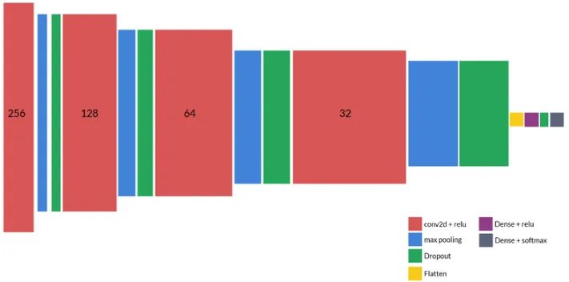
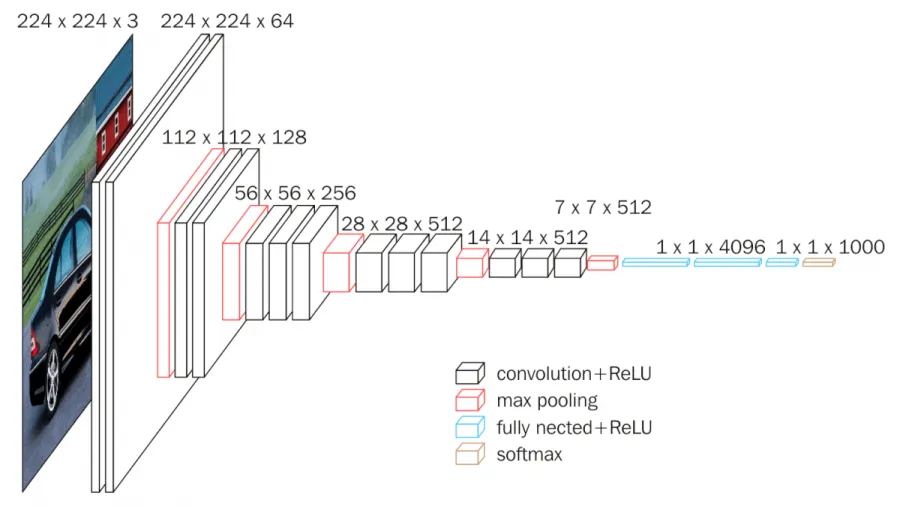
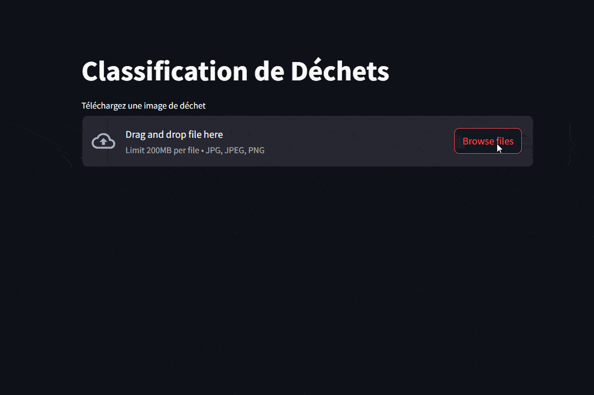

# Neovision
Classification des déchets pour l'entreprise Neovision grâce à l’intelligence artificielle

# Contexte du projet 

L’augmentation des déchets dans nos sociétés modernes nécessite des solutions efficaces pour leur gestion, en particulier en matière de tri et de recyclage. L’intelligence artificielle offre une opportunité précieuse en automatisant ce processus grâce à la reconnaissance d’images. Ce projet a pour objectif de développer un outil basé sur l’IA permettant la classification automatique des déchets à l’aide de réseaux de neurones convolutifs (CNN).  

Des recherches précédentes ont déjà exploité les CNN pour classer les déchets en utilisant la base de données *Trashnet*, qui regroupe des images réparties en six catégories : papier, carton, plastique, métal, verre et déchets non recyclables. Cette étude vise à améliorer cette approche en intégrant des modèles pré-entraînés et en optimisant la qualité des données utilisées.

# Objectif

L'objectif est de développer un modèle de classification des déchets atteignant plus de 80 % de précision, avec un temps d'inférence inférieur à 200 ms par image. Pour cela, il est essentiel d'optimiser l'architecture du modèle et d'utiliser une base de données large et équilibrée.

# Les étapes du projet

### 1. Proposition de Modèle CNN

Un modèle CNN est proposé avec la structure suivante :

### 2. Évaluation Initiale avec Trashnet et Neovision

Le modèle CNN est testé sur deux bases de données :

- **Trashnet** : Précision de 66% sur un ensemble de test (503 images).
- **Neovision** : Résultats moins performants, avec seulement 18% de précision sur le test.

### 3. Améliorations du Modèle

Plusieurs stratégies d'amélioration sont proposées :

- **Optimisation du CNN** : Modification de la structure du réseau (ajout/suppression de couches).
- **Utilisation de Modèles Pré-entraînés** : Le modèle *VGG-16*, déjà entraîné sur des bases de données comme *ImageNet*, est testé pour augmenter la précision.
- **Amélioration de la Base de Données** : Utilisation du web scrapping pour ajouter des images à la base *Neovision*.

### 4. Utilisation de Modèles Pré-entraînés

Le modèle VGG-16 sur Trashnet atteint une précision de 77,7% sur les données de test. Cependant, des problèmes de déséquilibre entre les classes persistent, notamment avec la catégorie "Trash" qui est souvent confondue avec d'autres catégories.

### 5. Optimisation de la base de données

L'amélioration des performances du modèle repose sur l’optimisation de la base de données, initialement restreinte et déséquilibrée. Ce projet adopte deux stratégies principales : l’enrichissement des données via le web scraping et l’application de techniques de data augmentation pour accroître la diversité et la qualité des images.

#### **Web Scraping**  

Le **web scraping** est utilisé pour enrichir la base de données **Neovision** en collectant des images de déchets provenant de diverses sources en ligne.  
- **Variété des images** : Les images récupérées présentent des différences en termes de qualité, de format et de style, ce qui peut complexifier l’entraînement du modèle en raison de l’hétérogénéité des données.  
- **Qualité variable** : Certaines images peuvent être floues, mal cadrées ou mal éclairées, risquant d’introduire des caractéristiques peu exploitables par le modèle.  

#### **Data Augmentation**  

Cette technique génère de nouvelles images en appliquant des transformations aux images existantes, augmentant ainsi la diversité des données et la robustesse du modèle. Parmi les transformations utilisées : **rotation, translation, zoom, cisaillement, inversion horizontale et ajustement de la luminosité**. Elle permet de :  
- **Réduire le surapprentissage**  
- **Améliorer la robustesse du modèle**  
- **Mieux équilibrer les classes de déchets**

### 6. Résultats de l'Optimisation

- **Amélioration de la précision** : Bien que le web scraping augmente significativement le volume de données, la **data augmentation** joue un rôle clé en générant une plus grande diversité d’images à partir des données existantes. Cette approche améliore les performances du modèle, notamment pour les catégories sous-représentées, en équilibrant mieux la distribution des classes.  
- **Défis persistants** : Malgré ces optimisations, des problèmes subsistent, notamment liés à la qualité des images et aux déséquilibres entre les classes. Certaines catégories, comme **"Plastic"** ou **"Trash"**, restent difficiles à classifier avec précision en raison d’un nombre insuffisant d’exemples représentatifs.

### 7. Application Web pour la Visualisation

Une application web est créée avec Flask pour afficher les résultats du modèle en temps réel. L'outil repose sur le modèle VGG-16 et permet de soumettre des images de déchets afin de prédire leur catégorie.

